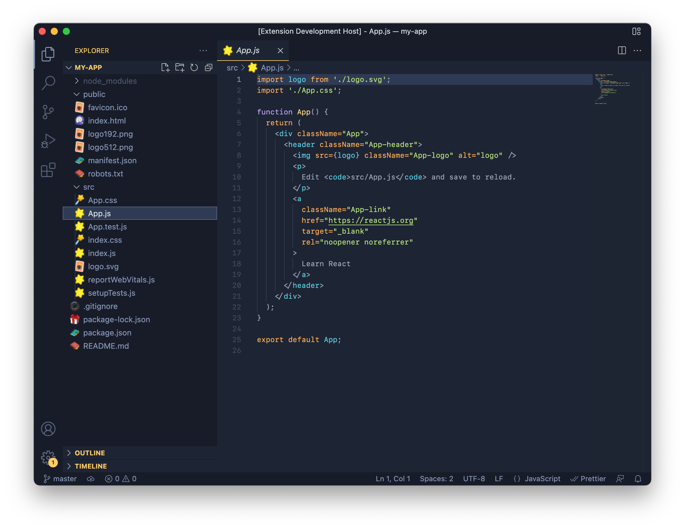

  

<h1>Animal Crossing File Icon Theme</h1>

An Animal Crossing: New Horizons themed file icon pack for VSCode! Currently supporting common web development file types. Other file types are a work in progress.

  Get it <a href="https://marketplace.visualstudio.com/items?itemName=angelenelm.animal-crossing-vscode-icon-theme">here</a>!
  
  

---

 

| icon                                                 | file      |
| ---------------------------------------------------- | --------- |
|            | `default` |
|               | `html`    |
|                 | `css`     |
|  | `js`      |
|    | `json`    |
|       | `md, txt` |
|           | `py`     |
|           | `images`  |
|                 | `logs`    |
|  | `git`     |
|             | `ignore`  |
|          | `lock`    |
|   | `env`     |

 

---

 

<h2>Resources</h2>

Icons from [Nookipedia](https://nookipedia.com/wiki/Category:New_Horizons_inventory_icons).
